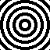
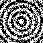
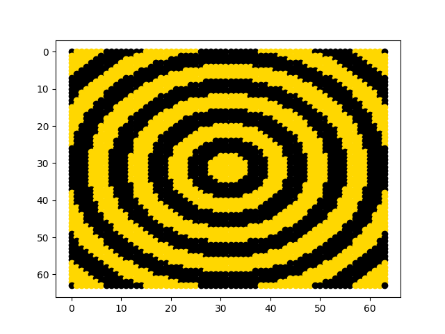

# Hopfield Network
This is my implementation of a hopfield network. A hopfield network is a neural network that is able to store patterns (images). If there is a stored pattern that becomes altered, it is able to revert the altered pattern back to the original pattern.

My network uses the hebbian rule, which is where neurons that fire together, wire together.The network state updates are implemented asynchronously, this just means that the nodes in the network are updated one-at-a-time. This makes the run time quite lengthy, also the more distorted the image is, the longer the program needs to run.

My implmentation saves images, gets a noisy version of one of the stored images, corrects it and plots the result.

The image below is a stored pattern located in the resources directory:\

The image below is an altered pattern, located in the very_distorted_states directory:\

The image below is the result after the program corrects altered pattern:\

## Constraints
1. The maximum number of patterns that can be stored in a network > `p = 0.14n`
   where n is the number of neurons/nodes in a network
2. The images have to be dichromatic
3. The images provided have to be the same size and have square dimensions e.g 40x40
4. the images have to have to have any of the following extensions:
    * .png
    * .jpg
    * .jpeg

## How to Run
Navigate to the root directory and run the bash script "run_script.hs"

You need to have the following libraries to run the program successfully, i will provide the terminal command to install these libraries as well:
   1. numpy: pip3 install numpy
   2. pillow(PIL): pip3 install pillow
   3. matplotlib: pip3 install matplotlib

## Future implementations
1. Synchronous updating
2. Altering the provided noisy image
3. Change the learning rule